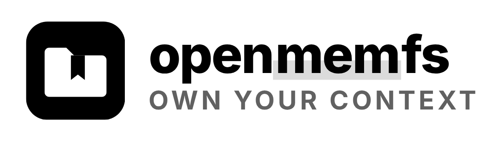

# openmemfs

<p></p>

A memory made of files, for you and your agents. A Notion-style editor over text files in
Postgres, with a REST API and an MCP server your agents use to do anything you can do. Small, and
extended by modules.

| | |
|---|---|
| **What it is** | A self-hosted file memory: an editor for people, an API for agents |
| **Status** | v0.1: editor, version history with optional commits, tags, categories, search, REST and MCP, modules |
| **Stack** | TanStack Start, React, TanStack Query, Hono, Postgres, TipTap, Tailwind, Bun |
| **Repo** | `gverdugo-dev/openmemfs`, public, MIT |
| **Part of** | `personal-public-resources`, the container of Gonzalo Verdugo's personal resources |

## What it does

- **Content**: every file opens in a Notion-like editor that reads and writes Markdown. It saves as
  you type.
- **History**: every change leaves a version, with who made it (you or an agent), and shows what
  changed line by line. Saves close together fold into one version. Committing is optional: it
  names a version with a message, and the history can show only the commits. Any version can be
  restored, and the restore is a version too.
- **Metadata**: a JSON object per file, where an agent writes notes for itself (state, summary,
  links) through the API or MCP, without touching the content.
- **Rename and move**: edit the name at the top of the page; a name starting with `/` moves the file.
- **New file and New folder**: buttons in the sidebar and on every folder page. You type a name;
  the file or folder goes where you are. A folder can be empty, and an empty folder can be deleted.
- **Drag and drop**: drag a file or a folder onto another folder, in the sidebar, on a folder page
  or onto a step of the path at the top, to move it. Dropping on the empty part of the sidebar moves
  it to the root.
- **Light and dark**: follows your system until you pick one with the button in the sidebar.
- **Tags**: on a file or on a folder (every file below carries a folder's tags when you filter).
- **Categories and subcategories**: one per file, managed on the Tags & categories page.
- **Search**: by file name, by content or both, filtered by tags (all of them), by category (with
  its subcategories) and by folder. Every search has a link.
- **Conflicts**: if an agent changes a file you have open, nothing is overwritten; you choose.
- **Modules**: new tabs, pages, routes and tables live in `src/modules/`, each in its own folder.

## How to use it

With Docker:

```bash
docker compose up
```

Open http://localhost:8080.

Anywhere else, build the `Dockerfile` and give it `DATABASE_URL` (any Postgres 13+). Migrations run
on the first request. See `.env.example` for the rest.

**There is no login and no key.** Whoever reaches the server reads, writes and deletes everything,
through the interface, the API and MCP. Run it on your own machine, or put it behind something that
controls access (a private network, a VPN, your host's authentication) before you expose it.

Locally, with Bun and a Postgres:

```bash
cp .env.example .env   # fill DATABASE_URL
bun install
bun run dev            # http://localhost:3000
```

To let an agent write, call the API:

```bash
curl -X POST http://localhost:8080/api/files \
  -H 'Content-Type: application/json' \
  -d '{"path": "/notes/today.md", "content": "# Today\n\n- ship it", "metadata": {"status": "draft"}}'
```

Or connect an MCP client. With Claude Code:

```bash
claude mcp add --transport http openmemfs http://localhost:8080/mcp
```

The agent gets a tool for everything the interface does: list and search files, read, create,
edit, move and delete them, tag files and folders, manage tags and categories, commit, and read or
restore versions.

## Structure

```
src/routes/   the workspace page, /api and /mcp
src/server/   the core: services, migrations, the REST and MCP doors
src/modules/  content, history, and yours
src/components/ the editor shell
migrations/   the core tables: files, categories, tags
```

## How it fits

openmemfs is the public, deployable version of a private memory service it grew out of:
the same idea (text files in Postgres, one service layer behind an HTTP door and an MCP door) with
its own editor built in and no dependency on any other resource. It needs one container and one
Postgres, and runs wherever those do.

## More information

- [CLAUDE.md](CLAUDE.md): the whole API, the MCP tools, the data model and how to
  write a module.
- `.env.example`: every variable the server reads.
- [LICENSE](LICENSE): MIT.
